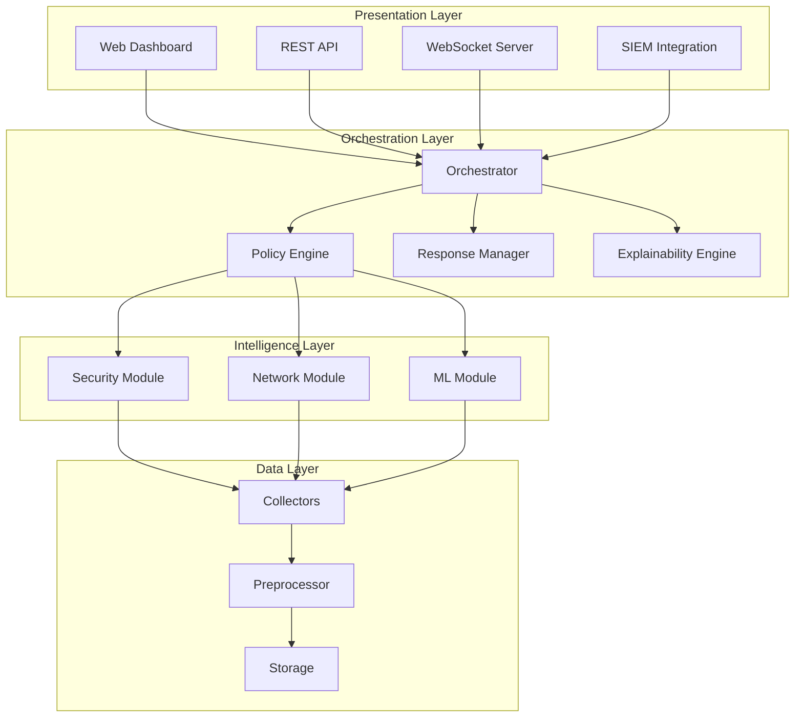
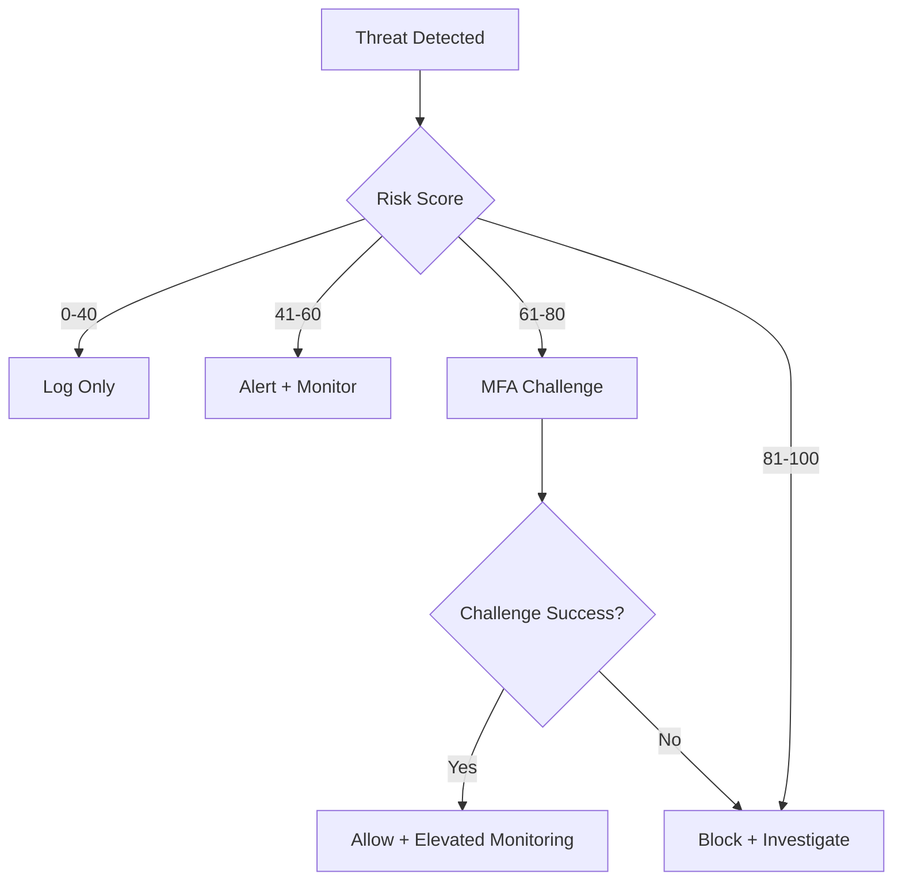

# System Architecture Documentation

## Executive Summary

The Intelligent Zero-Trust Security System is a next-generation cybersecurity platform that combines zero-trust architecture principles, real-time network telemetry analysis, and adaptive machine learning to provide comprehensive threat detection, prediction, and automated response capabilities.

## Architecture Overview

### Layered Architecture

The system follows a modular, layered architecture designed for scalability, maintainability, and extensibility:



## Core Components

### 1. Security Layer

#### Zero-Trust Architecture
**Purpose**: Implement "never trust, always verify" security model

**Key Components**:
- **Identity Verification**: Multi-factor authentication, continuous authentication
- **Access Control**: Dynamic, context-aware authorization
- **Device Posture**: Health and compliance checking
- **Micro-segmentation**: Network isolation and least privilege

**Implementation**:
```python
class ZeroTrustEngine:
    - verify_identity(user, context) -> bool
    - evaluate_access(user, resource, context) -> AccessDecision
    - assess_device_posture(device) -> PostureScore
    - enforce_policy(policy, context) -> Action
```

**Data Flow**:
1. User/device requests access
2. Identity verification (MFA, certificates)
3. Context collection (location, time, device, behavior)
4. Policy evaluation
5. Risk assessment
6. Access decision (allow/deny/challenge)
7. Continuous monitoring

#### Threat Detection Engine
**Purpose**: Identify security threats and malicious behavior

**Detection Capabilities**:
- Credential misuse and account compromise
- Privilege escalation attempts
- Abnormal access patterns
- Insider threat indicators
- Data exfiltration attempts

**Techniques**:
- Rule-based detection (YARA, Sigma rules)
- Statistical anomaly detection
- Behavioral analysis
- Threat intelligence correlation

### 2. Network Layer

#### Traffic Analyzer
**Purpose**: Deep packet inspection and flow analysis

**Capabilities**:
- Protocol analysis (TCP/UDP/ICMP/DNS/HTTP/TLS)
- Flow metrics (NetFlow, sFlow, IPFIX)
- Bandwidth and latency monitoring
- Connection tracking
- Packet capture and replay

**Architecture**:
```
┌─────────────┐
│   Network   │
│  Interface  │
└──────┬──────┘
       │
       ▼
┌─────────────┐
│   Packet    │
│   Capture   │
│  (libpcap)  │
└──────┬──────┘
       │
       ▼
┌─────────────┐
│   Parser    │
│  (Scapy)    │
└──────┬──────┘
       │
       ▼
┌─────────────┐
│   Feature   │
│ Extraction  │
└──────┬──────┘
       │
       ▼
┌─────────────┐
│  Analysis   │
│   Engine    │
└─────────────┘
```

#### Network Anomaly Detection
**Purpose**: Identify malicious network behavior

**Detection Targets**:
- **Lateral Movement**: Unusual internal connections, port scanning
- **Tunneling**: DNS tunneling, ICMP tunneling, protocol abuse
- **Beaconing**: C2 communication patterns
- **DGA Detection**: Domain generation algorithms
- **Exfiltration**: Large data transfers, unusual protocols

**Methods**:
- Time-series analysis for traffic patterns
- Graph analysis for connection topology
- Entropy analysis for randomness detection
- Frequency analysis for beaconing

### 3. Machine Learning Layer

#### Behavioral Profiler
**Purpose**: Build baseline behavior models for users and entities

**Profile Components**:
- **Temporal Patterns**: Login times, activity hours, session duration
- **Access Patterns**: Resources accessed, frequency, sequence
- **Location Patterns**: Geographic locations, IP addresses
- **Peer Groups**: Similar users, role-based clustering

**Modeling Approach**:
```python
# User behavior vector
behavior_vector = [
    login_time_distribution,
    resource_access_frequency,
    geographic_entropy,
    session_duration_stats,
    peer_group_similarity
]

# Baseline model (per user)
baseline_model = GaussianMixture(n_components=3)
baseline_model.fit(historical_behavior)

# Anomaly detection
current_behavior = extract_features(current_session)
anomaly_score = baseline_model.score_samples([current_behavior])
```

#### Anomaly Detection Models

**Multi-Algorithm Ensemble**:

1. **Isolation Forest**
   - Purpose: Outlier detection in high-dimensional space
   - Use case: Detecting rare, unusual events
   - Advantage: Fast, scalable, no assumptions about data distribution

2. **Autoencoder (Deep Learning)**
   - Purpose: Reconstruction-based anomaly detection
   - Use case: Complex, non-linear patterns
   - Architecture: Encoder (compress) → Latent space → Decoder (reconstruct)
   - Anomaly metric: Reconstruction error

3. **One-Class SVM**
   - Purpose: Novelty detection
   - Use case: Learning "normal" behavior boundary
   - Advantage: Robust to outliers in training data

4. **LSTM (Time Series)**
   - Purpose: Sequence anomaly detection
   - Use case: Temporal patterns, time-series data
   - Advantage: Captures long-term dependencies

5. **Statistical Methods**
   - Z-score, IQR, DBSCAN clustering
   - Use case: Simple, interpretable baselines

**Ensemble Strategy**:
```python
final_anomaly_score = weighted_average([
    isolation_forest_score * 0.3,
    autoencoder_score * 0.3,
    lstm_score * 0.2,
    ocsvm_score * 0.1,
    statistical_score * 0.1
])
```

#### Risk Scoring Engine
**Purpose**: Calculate dynamic, context-aware risk scores

**Risk Factors**:
- Anomaly scores from ML models
- Threat intelligence matches
- Historical behavior deviation
- Context (time, location, device)
- Peer group comparison
- Recent security events

**Scoring Formula**:
```
Risk Score = Σ (factor_i × weight_i × confidence_i)

Where:
- factor_i: Individual risk factor (0-1)
- weight_i: Importance weight
- confidence_i: Confidence in measurement
```

**Risk Levels**:
- **0-20**: Low (normal behavior)
- **21-40**: Moderate (minor deviations)
- **41-60**: Elevated (investigate)
- **61-80**: High (immediate attention)
- **81-100**: Critical (automated response)

### 4. Orchestration Layer

#### Central Orchestrator
**Purpose**: Coordinate all system components

**Responsibilities**:
- Event routing and processing
- Component lifecycle management
- Workflow orchestration
- State management
- Error handling and recovery

**Event Processing Pipeline**:
```
Event → Validation → Enrichment → Analysis → Decision → Action → Audit
```

#### Policy Engine
**Purpose**: Evaluate and enforce security policies

**Policy Types**:
- **Access Policies**: Who can access what, when, and how
- **Detection Policies**: What constitutes suspicious behavior
- **Response Policies**: How to respond to threats
- **Compliance Policies**: Regulatory requirements

**Policy Language** (YAML-based):
```yaml
policy:
  name: "High-Risk Access Control"
  condition:
    risk_score: ">= 60"
    resource_sensitivity: "high"
  actions:
    - type: "mfa_challenge"
    - type: "alert"
      severity: "high"
    - type: "log"
      detail: "full"
```

#### Response Manager
**Purpose**: Execute automated responses to threats

**Response Actions**:
1. **Alert**: Notify SOC, send email/SMS/webhook
2. **Challenge**: Require additional authentication (MFA)
3. **Restrict**: Temporary access limitation
4. **Block**: Deny access completely
5. **Isolate**: Network quarantine
6. **Investigate**: Trigger automated investigation workflow
7. **Escalate**: Human review required

**Response Decision Tree**:


#### Explainability Engine
**Purpose**: Provide transparent, interpretable decisions

**Techniques**:
- **SHAP (SHapley Additive exPlanations)**: Feature importance for ML models
- **LIME (Local Interpretable Model-agnostic Explanations)**: Local approximations
- **Decision Trees**: Rule-based explanations
- **Attention Mechanisms**: For deep learning models

**Output Format**:
```json
{
  "decision": "access_denied",
  "risk_score": 75,
  "confidence": 0.92,
  "explanation": {
    "primary_factors": [
      {"factor": "unusual_login_time", "contribution": 0.35},
      {"factor": "new_location", "contribution": 0.28},
      {"factor": "failed_mfa_attempts", "contribution": 0.22}
    ],
    "supporting_evidence": [
      "User typically logs in between 9AM-5PM EST",
      "Login from IP in Russia (user based in USA)",
      "3 failed MFA attempts in last 10 minutes"
    ],
    "recommendation": "Require additional verification"
  }
}
```

## Data Architecture

### Data Collection

**Sources**:
- Endpoint agents (process, file, network activity)
- Network taps (packet capture)
- Log collectors (syslog, Windows Event Log)
- API integrations (cloud services, SaaS)
- Threat intelligence feeds

**Collection Methods**:
- Push: Agents send data to central collector
- Pull: Collector queries data sources
- Stream: Real-time event streaming (Kafka, Redis)

### Data Storage

**Storage Tiers**:

1. **Hot Storage** (Redis)
   - Real-time data (last 24 hours)
   - Session state, cache
   - Fast read/write

2. **Warm Storage** (PostgreSQL)
   - Recent data (last 30 days)
   - User profiles, policies
   - Transactional queries

3. **Cold Storage** (S3/Object Storage)
   - Historical data (>30 days)
   - Compliance, forensics
   - Batch analytics

### Data Schema

**Event Schema**:
```json
{
  "event_id": "uuid",
  "timestamp": "iso8601",
  "source": "endpoint|network|api",
  "event_type": "authentication|access|network|file",
  "user": {
    "id": "string",
    "name": "string",
    "roles": ["array"]
  },
  "device": {
    "id": "string",
    "type": "string",
    "os": "string"
  },
  "context": {
    "ip": "string",
    "location": "geo",
    "time_of_day": "int"
  },
  "metadata": "object"
}
```

## Integration Architecture

### API Design

**REST API** (FastAPI):
- `/api/v1/auth/*` - Authentication endpoints
- `/api/v1/users/*` - User management
- `/api/v1/risk/*` - Risk score queries
- `/api/v1/policies/*` - Policy management
- `/api/v1/alerts/*` - Alert management
- `/api/v1/events/*` - Event queries

**WebSocket** (Real-time):
- `/ws/events` - Live event stream
- `/ws/alerts` - Alert notifications
- `/ws/metrics` - System metrics

### SIEM Integration

**Supported Platforms**:
- Splunk (HTTP Event Collector)
- Elastic Stack (Elasticsearch API)
- IBM QRadar (REST API)
- Microsoft Sentinel (Log Analytics API)

**Integration Pattern**:
```python
class SIEMConnector:
    def send_event(self, event):
        # Normalize to SIEM format
        normalized = self.normalize(event)
        # Send via SIEM API
        self.siem_client.send(normalized)
```

## Deployment Architecture

### Microservices Deployment

**Services**:
1. **API Gateway**: External interface, authentication
2. **ML Engine**: Model serving, inference
3. **Collector**: Data ingestion
4. **Orchestrator**: Central coordination
5. **Dashboard**: Web UI

**Communication**:
- Synchronous: REST API (service-to-service)
- Asynchronous: Message queue (Redis Pub/Sub, Kafka)
- Real-time: WebSocket

### Scalability

**Horizontal Scaling**:
- API Gateway: Load balancer + multiple instances
- ML Engine: Model serving cluster
- Collectors: Distributed agents

**Vertical Scaling**:
- ML training: GPU acceleration
- Database: Read replicas, sharding

**Performance Optimization**:
- Caching (Redis)
- Connection pooling
- Batch processing
- Async I/O

## Security Considerations

### System Security

**Authentication**:
- JWT tokens with short expiration
- Refresh token rotation
- API key management

**Authorization**:
- Role-based access control (RBAC)
- Service-to-service authentication (mTLS)

**Data Protection**:
- Encryption at rest (AES-256)
- Encryption in transit (TLS 1.3)
- PII anonymization
- Secure key management (HashiCorp Vault)

**Audit Logging**:
- All security decisions logged
- Immutable audit trail
- Compliance reporting

## Monitoring & Observability

**Metrics** (Prometheus):
- System metrics (CPU, memory, network)
- Application metrics (request rate, latency, errors)
- Business metrics (threats detected, false positives)

**Logging** (Structured JSON):
- Application logs
- Security events
- Audit logs

**Tracing** (OpenTelemetry):
- Distributed tracing across microservices
- Performance profiling

**Dashboards** (Grafana):
- System health
- Threat landscape
- ML model performance
- SLA metrics

## Technology Stack

**Backend**:
- Python 3.9+ (core language)
- FastAPI (API framework)
- TensorFlow/PyTorch (ML frameworks)
- Scikit-learn (ML algorithms)

**Data**:
- PostgreSQL (relational data)
- Redis (cache, real-time data)
- MongoDB (document storage, optional)

**Network**:
- Scapy (packet manipulation)
- PyShark (packet analysis)
- dpkt (packet parsing)

**Frontend**:
- HTML5/CSS3/JavaScript
- Chart.js/D3.js (visualization)
- WebSocket (real-time updates)

**Infrastructure**:
- Docker (containerization)
- Docker Compose (orchestration)
- Kubernetes (production orchestration, optional)

## Future Enhancements

1. **Advanced ML**:
   - Graph neural networks for network topology
   - Transformer models for sequence analysis
   - Federated learning for privacy-preserving training

2. **Extended Detection**:
   - Cloud security posture management (CSPM)
   - Container security
   - IoT device monitoring

3. **Automation**:
   - Automated threat hunting
   - Self-healing systems
   - Predictive maintenance

4. **Integration**:
   - SOAR platform integration
   - Threat intelligence platforms
   - Identity providers (Okta, Azure AD)
